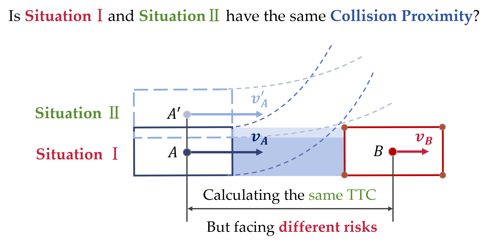
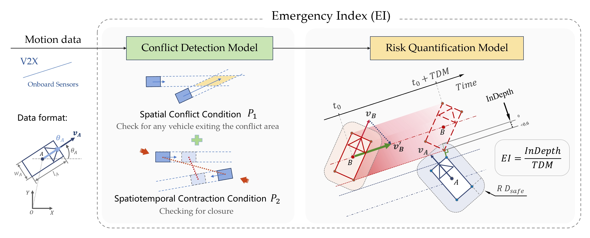

# Emergency Index (EI): A two-dimensional surrogate safety measure considering vehicles' interaction depth
Surrogate safety measures (SSMs) such as Time-to-Collision (TTC) are classic metrics that align with people's intuitive understanding of safety and have now become essential standards for assessing autonomous vehicles' safety.
- However, are there moments when you're unsure how to calculate TTC? For instance, during merging events or multi-angle conflict scenarios at complex intersections?
- Do you ever feel that the TTC calculation logic may be too simplistic for safety assessment? For example, in the situations shown in the Figure 1, is the risk truly the same?

  

<em>Figure 1: TTC-based indicators can measure the intensity of collision avoidance along the current closure direction. However, in 2D scenarios, evasive maneuvers are not limited to actions along the current closure direction. Evasive actions may involve various possibilities, such as lateral or combined maneuvers, which TTC-based indicators struggle to quantify effectively</em>

Don't worry! We will provide you with a new SSM—Emergency Index (EI), which is applicable to various forms of conflicts in a 2D plane. It can assess more granular levels of risk and, like TTC, has an intuitive physical meaning.

Compared to previous indicators, we have considered a new dimension. EI utilizes the concept of Interaction Depth (InDepth), defined as the maximum depth at which two vehicles are projected to intrude into each other's safety region, representing the necessary adjustments for pre-collision states. The physical significance of EI lies in the rate of change in InDepth required for evasive actions, offering unique insights into crash avoidance strategies. Additionally, we propose a conflict detection model to comprehensively screen potential conflict vehicles.

  

<em>Figure 2: The framework of EI</em>

## Input 
- `Time (s)`      :    The timestamp. (In this case, the sampling frequency of the CSV file is 100 Hz.)
- `Position X (m)`      :   The x-coordinate of the vehicle's centroid position.
- `Position Y (m)`     :  The y-coordinate of the vehicle's centroid position.
- `Velocity (m/s)`     :  The speed of the vehicle in meters per second.
- `Heading`     :  The heading angle of the vehicle, represented as an angle in radians, ranging from -3.14 to 3.14.
- `Length (m)` :  The length of the vehicle in meters.
- `Width (m)`  :  The width of the vehicle in meters.
- `Vehicle Number`      : The unique ID assigned to each vehicle.

## Output 
- `TDM (s)`      :    Time-to-Depth-Maximum (TDM), a component of EI, indicating the remaining time available for evasive actions.
- `MFD (m)`      :   Interaction Depth (InDepth), a component of EI, defined as the maximum depth of intrusion into each other's safety region. It represents the required adjustments to pre-collision states.
- `EI (m/s)`     :  Emergency Index (EI), representing the intensity of evasive action needed for two vehicles to avoid risk. It reflects the required rate of state adjustments in evasive maneuvers. Physically, EI indicates the rate at which InDepth must change to ensure successful evasive actions.
