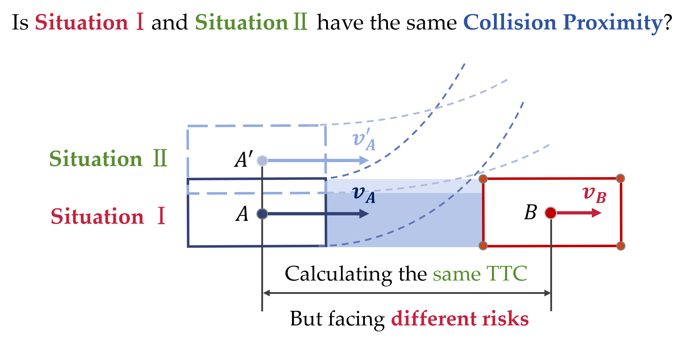

# Emergency Index (EI): A two-dimensional surrogate safety measure considering vehicle interaction depth
Surrogate safety measures (SSMs) such as Time-to-Collision (TTC) are classic metrics that align with people's intuitive understanding of safety and have now become essential standards for assessing autonomous vehicle's safety.
- However, are there moments when you're unsure how to calculate TTC? For instance, during merging events or multi-angle conflict scenarios at complex intersections?
- Do you ever feel that the TTC calculation logic may be too simplistic for safety assessment? For example, in the situations shown in the figure, is the risk truly the same?

  

Don't worry! We will provide you with a new SSM—Emergency Index (EI), which is applicable to various forms of conflicts in a 2D plane. It can assess more granular levels of risk and, like TTC, has an intuitive physical meaning.

Compared to previous indicators, we have considered a new dimension. EI utilizes the concept of Interaction Depth (InDepth), defined as the maximum depth at which two vehicles are projected to intrude into each other's safety region, representing the necessary adjustments for pre-collision states. The physical significance of EI lies in the rate of change in InDepth required for evasive actions, offering unique insights into crash avoidance strategies. Additionally, we propose a conflict detection model to comprehensively screen potential conflict vehicles.
